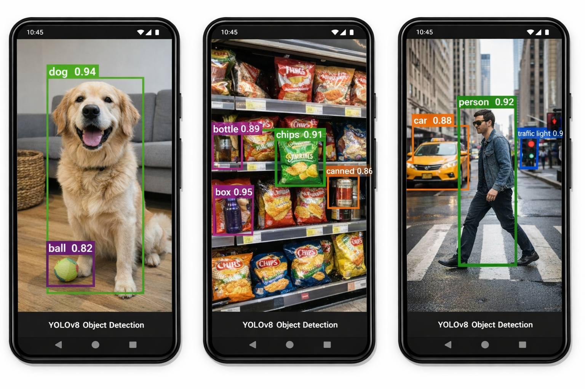

# Android Object Detection App (YOLOv8 + CameraX)

A real-time object detection Android application built using:

- YOLOv8 (TensorFlow Lite)
- CameraX
- Jetpack Compose
- Kotlin
- On-device inference (no network required)

## ✨ Features

- Live camera preview using CameraX
- Real-time object detection with YOLOv8
- Bounding boxes with class labels & confidence
- Optimized for mobile performance
- Clean, production-ready architecture

## 🛠 Tech Stack

- Kotlin
- Jetpack Compose
- CameraX
- TensorFlow Lite
- YOLOv8 (Float32 model)

## 📱 Screenshots

<p align="center">
  
</p>

## 🚀 Getting Started

### 1. Clone the repo
```bash
git clone https://github.com/<your-username>/android-yolo-object-detection.git
